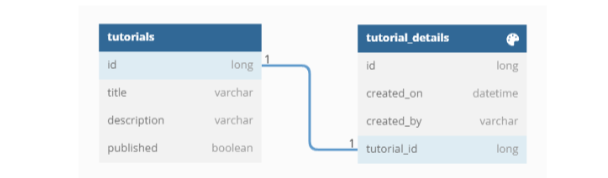
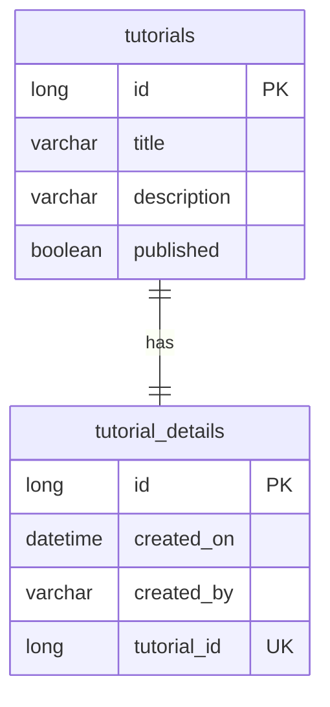

# Tutorial API — Prueba técnica OATI (Enunciado 4)

API REST para gestión de tutoriales con detalle en contexto de aprendizaje virtual. Resuelve el **Enunciado 4** de la prueba técnica de ingreso OATI — Universidad Distrital Francisco José de Caldas.

**Repositorio:** https://github.com/Nicoller-24/tutorial-api-ud

---

## Descripción

Permite registrar tutoriales con título, descripción y estado de publicación (`published`), junto con un **detalle único** (relación 1:1) que incluye la fecha de creación y el usuario creador.

Operaciones soportadas:

- Listar tutoriales (con filtro opcional por `published`)
- Consultar un tutorial con su detalle
- Crear, modificar y eliminar tutoriales
- Registrar, consultar, modificar y eliminar el detalle de un tutorial
- Eliminar un tutorial elimina en cascada su detalle
- Eliminar solo el detalle deja el tutorial sin detalle (permite registrar uno nuevo con `POST /detail`)

---

## Stack tecnológico

| Capa | Tecnología |
|------|------------|
| Lenguaje | Python 3.12+ |
| Framework API | FastAPI |
| ORM | SQLAlchemy 2.x |
| Validación | Pydantic v2 |
| Base de datos (local) | SQLite |
| Base de datos (Docker) | PostgreSQL 16 |
| Servidor | Uvicorn |
| Tests | pytest + httpx |
| Documentación API | Swagger UI (`/docs`) y ReDoc (`/redoc`) |
| Migraciones | Alembic |
| Contenedores | Docker + Docker Compose |

---

## Modelo de datos

Diagrama oficial OATI (Enunciado 4):





| Tabla | Columna | Descripción |
|-------|---------|-------------|
| `tutorials` | `id` | Identificador único |
| `tutorials` | `title` | Título del tutorial |
| `tutorials` | `description` | Descripción del tutorial |
| `tutorials` | `published` | `true` = visible, `false` = oculto |
| `tutorial_details` | `id` | Identificador del detalle |
| `tutorial_details` | `created_on` | Fecha de creación (generada por el servidor) |
| `tutorial_details` | `created_by` | Usuario que creó el tutorial |
| `tutorial_details` | `tutorial_id` | FK única hacia `tutorials.id` (1:1) |

---

## Estructura del proyecto

```
tutorial-api/
├── app/
│   ├── main.py                 # Punto de entrada FastAPI
│   ├── config.py               # Configuración (variables de entorno)
│   ├── database.py             # Conexión y sesión SQLAlchemy
│   ├── models/                 # Entidades ORM (tutorials, tutorial_details)
│   ├── schemas/                # DTOs Pydantic (request/response)
│   ├── repositories/           # Acceso a datos
│   ├── services/               # Lógica de negocio
│   ├── routers/                # Endpoints REST
│   └── exceptions/             # Manejo centralizado de errores
├── alembic/                    # Migraciones de base de datos
│   └── versions/
├── tests/                      # Pruebas automatizadas
├── docs/                       # Diagrama ER y evidencias
│   └── evidence/
├── alembic.ini
├── requirements.txt
├── Dockerfile
├── docker-compose.yml
└── README.md
```

---

## Instrucciones de ejecución

### Requisitos

- Python 3.12 o superior
- pip

### Ejecución local (SQLite)

```bash
# Clonar el repositorio
git clone https://github.com/Nicoller-24/tutorial-api-ud.git
cd tutorial-api-ud

# Crear entorno virtual
python -m venv .venv

# Activar entorno (Windows)
.venv\Scripts\activate

# Activar entorno (Linux/macOS)
source .venv/bin/activate

# Instalar dependencias
pip install -r requirements.txt

# Copiar variables de entorno (opcional)
copy .env.example .env

# Aplicar migraciones de base de datos
alembic upgrade head

# Iniciar servidor
uvicorn app.main:app --reload
```

La API estará disponible en: **http://localhost:8000**

- Swagger UI: http://localhost:8000/docs
- ReDoc: http://localhost:8000/redoc
- Health check: http://localhost:8000/

### Ejecución con Docker

```bash
docker compose up --build
```

La API aplicará `alembic upgrade head` al arrancar y estará en **http://localhost:8000** usando PostgreSQL.

### Ejecutar tests

```bash
pytest -v
```

---

## Endpoints

Base URL: `/api/v1`

### Tutoriales

| Método | URI | Descripción |
|--------|-----|-------------|
| `GET` | `/tutorials` | Listar tutoriales (`?published=true\|false`) |
| `POST` | `/tutorials` | Crear tutorial con detalle |
| `GET` | `/tutorials/{id}` | Obtener tutorial con detalle |
| `PUT` | `/tutorials/{id}` | Actualizar tutorial |
| `DELETE` | `/tutorials/{id}` | Eliminar tutorial y detalle |

### Detalle del tutorial

| Método | URI | Descripción |
|--------|-----|-------------|
| `GET` | `/tutorials/{id}/detail` | Consultar detalle |
| `POST` | `/tutorials/{id}/detail` | Registrar detalle en tutorial existente (409 si ya tiene) |
| `PUT` | `/tutorials/{id}/detail` | Modificar detalle |
| `DELETE` | `/tutorials/{id}/detail` | Eliminar solo el detalle (tutorial permanece) |

### Ejemplo: crear tutorial

```bash
curl -X POST http://localhost:8000/api/v1/tutorials \
  -H "Content-Type: application/json" \
  -d '{
    "title": "Introducción a FastAPI",
    "description": "Tutorial básico de APIs REST",
    "published": true,
    "detail": {
      "created_by": "profesor.garcia@udistrital.edu.co"
    }
  }'
```

---

## Evidencia de funcionamiento

1. Aplicar migraciones: `alembic upgrade head`
2. Iniciar la API: `uvicorn app.main:app --reload`
3. Abrir **http://localhost:8000/docs** (Swagger UI interactivo)
4. Probar `POST /api/v1/tutorials` con el body de ejemplo
5. Verificar `GET /api/v1/tutorials` y `GET /api/v1/tutorials/{id}/detail`
6. Probar `DELETE /api/v1/tutorials/{id}/detail` y luego `POST /api/v1/tutorials/{id}/detail`

Capturas recomendadas en [`docs/evidence/`](docs/evidence/):

- `01-post-tutorial.png` — Creación de tutorial (201)
- `02-list-tutorials.png` — Listado de tutoriales
- `03-detail-crud.png` — DELETE + POST del detalle

---

## Criterios OATI cubiertos

| Criterio | Implementación |
|----------|----------------|
| Control de versiones | Git + GitHub |
| Documentación | Este README + Swagger |
| Buenas prácticas | Capas separadas (router → service → repository → model) |
| API REST CRUD | Endpoints completos con manejo de excepciones |
| Persistencia | SQLAlchemy + Alembic con modelo coherente al diagrama ER |
| Swagger (opcional) | `/docs` y `/redoc` |
| Docker (opcional) | `Dockerfile` + `docker-compose.yml` |
| Tests (opcional) | 23 pruebas con pytest |

---

## Autor

Desarrollado como solución al Enunciado 4 — Prueba técnica OATI, Universidad Distrital.
